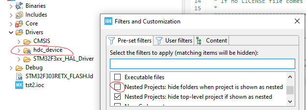

# About
The ``STM32`` sub-folder contains source-code for the [STM32](https://en.wikipedia.org/wiki/STM32) family of microcontrollers.

* ``hdc_device``  
  Generic HDC device implementation.    
  You typically will copy this folder as-is into the ``Drivers`` sub-folder of your Stm32CubeMX generated source-code structure.  
  Any non-generic HDC features specific to your project should be kept in the ``MyProject/Core/`` Src and Inc folders.
  
* ``demos``  
  Contains STM32CubeIDE demo projects showcasing how HDC can be implemented in STM32 based devices.  
  Those projects are quite bloated with autogenerated code, but you can search for occurrences of "hdc" to locate the relevant spots in the code.  
  * Demo_Minimal_NUCLEO-F303RE  
    Minimal example of how to implement HDC. You'll need a NUCLEO-F303RE prototyping board to run this demo.  
    Build with STM32 Project creation wizzard, using package "STM32Cube FW_F3 v1.11.3".

  
# HowTo

## How to set up your personal IDE "workspace"
You can create your own, personal STM32CubeIDE "workspace" directly in this STM32 folder 
and selectively "import" into it any of the demo projects you may want to try out.
Note how ``.gitignore`` will exclude the ``.metadata`` folder of your "workspace" from this git repository.

## How to link to the hdc_device folder from demo projects 
Projects within ``STM32/demos/`` use a "linked folder" to reference the source-code contained in ``STM32/hdc_device/``. 
If the "project explorer" pane of the IDE does not show any ``MyDemoProject/Drivers/hdc_device`` folder, it might be 
because of the IDE's "Filter" settings hiding nested projects by default.
Deactivate the following checkbox to fix this:


When creating a new demo project, remember to:
* Right click on the ``MyDemoProject/Drivers/`` folder as shown in the project explorer of the IDE 
  and use ``New../ Folder / Advanced / LinkedFolder`` to reference the ``STM32/hdc_device/`` folder of this repository.
  
* Right click on ``MyDemoProject/Drivers/hdc_device/`` and use ``Add include path...`` 
  for the build system to be able to locate the header files contained therein.


## How to deploy the ``hdc_device`` driver into your own projects
Current ``hdc_device`` implementation is hardcoded to use USART via DMA via their HAL drivers.
This is how you should set up your project:
* Use the STM32 project creation wizzard to set up a new STM32CubeMX based project 
  for the kind of microcontroller or prototyping board of your choice.
* Copy the ''STM32/hdc_device/'' folder of this repository into the ``Drivers/`` folder of your project.
* Open the ioc file of your project and tweak the following:
  * Enable a USART module to be used for HDC communication.  
    Projects for NUCLEO boards are typically already set up with the USART which uses the 
    integrated ST-LINK as a gateway exposed as a USB Virtual-COM-Port at the USB connector of the NUCLEO board.  
    Code snipets below refer to USART2. Make sure to change those to whatever USART module number you are using for HDC in your project. 
    Also double-check the baudrate setting. NUCLEO-F303RE project was incorrectly initialized to 38400, instead of 115200 baud!
    
  * Enable DMA feature for that USART  
    In configuration pane at ``Connectivity / USARTx / DMA`` add DMA settings for both ``USARTx_RX`` and ``USARTx_TX``  
     
  * Enable global interrupt for that USART  
    In configuration pane at ``Connectivity / USARTx / NVIC`` enable the checkbox ``USART global interrupt``.  
	 
* Implement interrupt handlers for DMA transfers in your ``*_it.c`` file:

  * Include the hdc_device header in the ``USER CODE Includes`` section:
    ```C
    /* USER CODE BEGIN Includes */
    #include "hdc_device.h"
    /* USER CODE END Includes */
    ```

  * Copy the following into the ``USER CODE 1`` section:
    ```C
    /* USER CODE BEGIN 1 */
    void HAL_UART_RxCpltCallback(UART_HandleTypeDef *huart) {
      HDC_RxCpltCallback(huart);
    }

    void HAL_UART_TxCpltCallback(UART_HandleTypeDef *huart) {
      HDC_TxCpltCallback(huart);
    }
    /* USER CODE END 1 */
    ```
	 
  * Copy the following into the ``USER CODE USARTx_IRQn`` section:  
    (Section will be missing if you forgot to enable the ``USART global interrupt`` option of the ioc file.)
    ```C
    /* USER CODE BEGIN USART2_IRQn 1 */
    HDC_IrqRedirection_UartIdle();  // Redirects the IDLE event into the HDC_RxCpltCallback() handler.
    /* USER CODE END USART2_IRQn 1 */
    ```


# Troubleshooting
* How to verify if data is being transfered correctly?
  Set a breakpoint in ``hdc_device.c`` in ``HDC_RxCpltCallback()`` and check whether any bytes have been sent 
  when running i.e. ``demo_introspection.py`` script on the host.
  If the handler is called, but zero bytes have been received, it might be an indication that you 
  may need to fix the USART parameters, like e.g. the baudrate.


# ToDo
* Are there better ways to share STM32 source code?
  Learn how others setup their STM32 repositories:
  * https://github.com/afiskon/stm32-ssd1306

* Refactor ``hdc_device`` implementation for a cleaner separation of USART / USB-VCP / etc implementations.
  * Abstracting the interface to the transport layer may not be worth it, because it might degrade the clarity and performance of the implementation!
